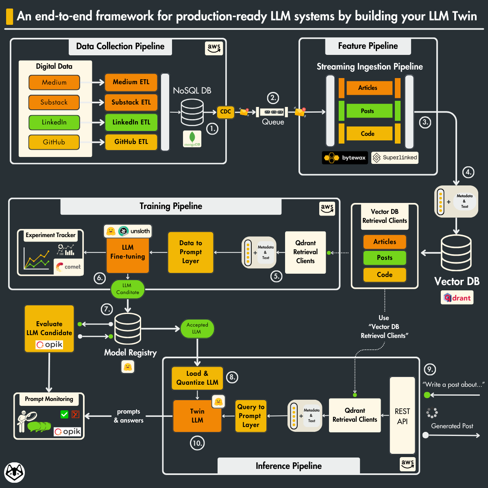
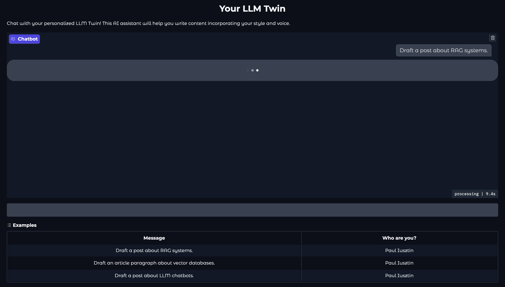

<div align="center">
    <h2>LLM-Twin: Production-Ready AI Replica</h2>
    <h1>An end-to-end production-ready LLM & RAG system.</h1>
    <h3>From data gathering to productionizing LLMs using LLMOps good practices.</h3>
</div>

</br>

<p align="center">
  
</p>

## 🤖 What is LLM-Twin

**LLM-Twin** is *AI replica* that writes social media posts or technical articles (like this one) using your own voice.

## 🪈 The architecture of the LLM Twin is split into 4 Python microservices

<p align="center">
  
</p>

### The data collection pipeline

- Crawl your digital data from various social media platforms, such as Medium, Substack and GitHub.
- Clean, normalize and load the data to a [Mongo NoSQL DB](https://www.mongodb.com/) through a series of ETL pipelines.
- Send database changes to a [RabbitMQ](https://www.rabbitmq.com/) queue using the CDC pattern.
- Learn to package the crawlers as AWS Lambda functions.

### The feature pipeline

- Consume messages in real-time from a queue through a [Bytewax](https://github.com/bytewax/bytewax?utm_source=github&utm_medium=decodingml&utm_campaign=2024_q1) streaming pipeline.
- Every message will be cleaned, chunked, embedded and loaded into a [Qdrant](https://qdrant.tech/?utm_source=decodingml&utm_medium=referral&utm_campaign=llm-course) vector DB.
- In the bonus series, we refactor the cleaning, chunking, and embedding logic using [Superlinked](https://github.com/superlinked/superlinked?utm_source=community&utm_medium=github&utm_campaign=oscourse), a specialized vector compute engine. We will also load and index the vectors to a [Redis vector DB](https://redis.io/solutions/vector-search/).

### The training pipeline

- Create a custom instruction dataset based on your custom digital data to do SFT.
- Fine-tune an LLM using LoRA or QLoRA.
- Use [Comet ML's](https://www.comet.com/signup/?utm_source=decoding_ml&utm_medium=partner&utm_content=github) experiment tracker to monitor the experiments.
- Evaluate the LLM using [Opik](https://github.com/comet-ml/opik)
- Save and version the best model to the [Hugging Face model registry](https://huggingface.co/models).
- Run and automate the training pipeline using [AWS SageMaker](https://aws.amazon.com/sagemaker/).

### The inference pipeline

- Load the fine-tuned LLM from the [Hugging Face model registry](https://huggingface.co/models).
- Deploy the LLM as a scalable REST API using [AWS SageMaker inference endpoints](https://aws.amazon.com/sagemaker/deploy/).
- Enhance the prompts using advanced RAG techniques.
- Monitor the prompts and LLM generated results using [Opik](https://github.com/comet-ml/opik)
- In the bonus series, we refactor the advanced RAG layer to write more optimal queries using [Superlinked](https://github.com/superlinked/superlinked?utm_source=community&utm_medium=github&utm_campaign=oscourse).
- Wrap up everything with a Gradio UI (as seen below) where you can start playing around with the LLM Twin to generate content that follows your writing style.

<p align="center">
  
</p>

Along the 4 microservices, you will learn to integrate 4 serverless tools:

* [Comet ML](https://www.comet.com/signup/?utm_source=decoding_ml&utm_medium=partner&utm_content=github) as your experiment tracker and data registry;
* [Qdrant](https://qdrant.tech/?utm_source=decodingml&utm_medium=referral&utm_campaign=llm-course) as your vector DB;
* [AWS SageMaker](https://aws.amazon.com/sagemaker/) as your ML infrastructure;
* [Opik](https://github.com/comet-ml/opik) as your prompt evaluation and monitoring tool.

## 🎓 Prerequisites

| Category | Requirements |
|----------|-------------|
| **Skills** | Basic understanding of Python and Machine Learning |
| **Hardware** | Any modern laptop/workstation will do the job, as the LLM fine-tuning and inference will be done on AWS SageMaker. |
| **Level** | Intermediate |

## 🏗️ Project Structure

At Decoding ML we teach how to build production ML systems, thus the course follows the structure of a real-world Python project:

```text
llm-twin-course/
├── src/                     # Source code for all the ML pipelines and services
│ ├── data_crawling/         # Data collection pipeline code
│ ├── data_cdc/              # Change Data Capture (CDC) pipeline code
│ ├── feature_pipeline/      # Feature engineering pipeline code
│ ├── training_pipeline/     # Training pipeline code
│ ├── inference_pipeline/    # Inference service code
│ └── bonus_superlinked_rag/ # Bonus RAG optimization code
├── .env.example             # Example environment variables template
├── Makefile                 # Commands to build and run the project
├── pyproject.toml           # Project dependencies
```


## 🚀 Install & Usage

To understand how to **install and run the LLM Twin code end-to-end**, go to the [INSTALL_AND_USAGE](https://github.com/yordanoswuletaw/llm-twin/blob/main/INSTALL_AND_USAGE.md) dedicated document.


## 🥂 Acknowledgments

This project is based on the <a href="https://github.com/decodingml/llm-twin-course?tab=readme-ov-file#lessons">LLM Twin: Building Your Production-Ready AI Replica</i></a> course by <a href="https://decodingml.substack.com">Decoding ML</a> . Special thanks to the original authors and contributors for their invaluable course.

## License

This course is an open-source project released under the MIT license. Thus, as long you distribute our LICENSE and acknowledge our work, you can safely clone or fork this project and use it as a source of inspiration for whatever you want (e.g., university projects, college degree projects, personal projects, etc.).# llm-twin
